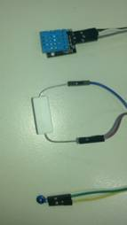

# Telescope Dew Heater

This project brings together a few Duinotech Modules and some other parts to create a versatile tool. Inspired by the Dew Heaters used on telescopes, it senses ambient temperature and humidity to control a small heater. Not just for telescopes, but anything that needs to avoid condensation.

## Features include:
- Programmable temperature setpoint
- Temperature target can be set above ambient or dewpoint
- Settings can be saved to EEPROM
- Adjustable failsafe heater output to use if sensors are faulty
- Comprehensive LCD info screen

By making use of as much data as possible, the unit uses no more power than necessary, and can even be run straight from a USB battery pack. It can run a set number of degrees above either dewpoint or ambient temperature. The backlight intensity is also adjustable in code and we've even designed a 3d-printed enclosure that will practically turn it into a professional looking unit.

## Components

| Qty | Code                                    | Description                     |
| --- | --------------------------------------- | ------------------------------- |
| 1   | [XC4520](http://jaycar.com.au/p/XC4520) | Temperature and Humidity module |
| 1   | [XC4454](http://jaycar.com.au/p/XC4454) | LCD controller shield           |
| 1   | [XC4410](http://jaycar.com.au/p/XC4410) | UNO main board                  |
| 1   | [RN3440](http://jaycar.com.au/p/RN3440) | 10K Thermistor                  |
| 1   | [RR0596](http://jaycar.com.au/p/RR0596) | 10K resistor                    |
| 1   | [RR0572](http://jaycar.com.au/p/RR0572) | 1K resistor                     |
| 1   | [ZT2468](http://jaycar.com.au/p/ZT2468) | MOSFET                          |
| 1   | [XC4482](http://jaycar.com.au/p/XC4482) | Proto shield                    |
| 1   | [WC6028](http://jaycar.com.au/p/WC6028) | Plug-socket lead                |
| 1   | [RR3264](http://jaycar.com.au/p/RR3264) | 5W 390 resistor                 |

The 5W resistor is the heater element. For more power, even a RR3254 15Ohm resistor will happily run off most USB ports (up to 500mA), giving about 1.6 Watts. Another option is to run multiple resistors in parallel to distribute the heat better. For more power, a proper telescope heat band should be used. These usually use an RCA plug, so an RCA socket like PS0250 could be fitted. The circuit uses the VIN pin on the Proto Shield, which cannot handle more than about 1A of current.

## Assembly

Most of the assembly involves adding components to the Proto Shield to give it all the extra functionality it needs. There are effectively three subcircuits on the Proto Shield, one for the thermistor, and another for the humidity sensor and the third to drive a MOSFET for the heater.

The photos below give a guide as to one way to assemble it, but there is a small area (surrounded by a white rectangle) on the Proto Shield which has numerous 5V and GND connections and some short strips, making this an ideal spot to put all this together, especially to make the 5V and GND connections.

The thermistor subcircuit looks like this:

The yellow wire above goes to A1 and one of each of the resistor and thermistor, while the green wire goes to 5V, giving a simple voltage divider.

The top black wire connects the S pin of the module to D3.

The MOSFET circuit is the most complex:

In the main photo above, the MOSFET's leads are G(gate), D(drain) and S(source), looking from top to bottom. The blue and purple wires run off the board to the 39R resistor, while the two white wires feed the 39R resistor from VIN and the MOSFET drain. The 10k resistor on the left ensures that the MOSFET is off unless the Uno is telling it to be on, while the 1k resistor provides a bit of isolation in case the MOSFET fails.

## Sketch

The code is quite lengthy and uses four different libraries. Luckily, only one of these needs to be installed, all the rest come with the Arduino IDE. The idDHT11 library reads the temperature and humidity sensor and also calculates the dew point. The file is Telescope_Dew_Heater.ino.

Before `setup()`, we initialise all the libraries and global variables. There is also a large array `temps[]` which stores the thermistor temperature conversion. For accuracy, all temperatures are calculated in tenths of a degree.

In setup, the LCD is initialised and values loaded from EEPROM. If these are valid, they are loaded into their respective variables. Because the DHT11 library does its readings in the background, we start a reading now for when we need one in `loop()`. Then we set the backlight intensity.

In `loop()`, the sketch reads all the input, including thermistor, DHT11 temperature, humidity and dew point and keypad. Then it responds to the keypad- if left is pressed, the heater works from the dew point temperature in 'D' mode, if the right button is presses, 'A' mode works with ambient temperature. The setpoint for the heater is set by the up and down buttons between zero and nine degrees. The select button allows the current settings to be saved in EEPROM. How long the button is held down determines what the default heater output will be if a sensor failure is detected.

The temperature target is calculated and the heater output is adjusted by changing the PWM on pin 11, then the current state is output is displayed. If an invalid reading is detected in either sensor, a message is displayed and the heater is set to the default output.

In the above image, the ambient temperature is 26 degrees, but the dewpoint temperature is 11 degrees, so the heater will be aiming for dewpoint plus six degrees, or 17 degrees. The actual telescope temperature is 26 degrees, so the heater is off. If the heater was switched to ambient mode by pressing the right button, then the target would be 32 degrees, and the heater would turn fully on. In normal operation, the thermistor should be near, but not quite touching the heater resistor, so that it can quickly respond to changes.

## Improvements

There are a number of places where the heater could be improved, such as changing the default backlight setting to suit your application, or even making it one of the EEPROM settings. If you need more power, the recommended MOSFETs are capable of at least 5A at 24V. In that case, it would be recommended to run the power supply straight to the MOSFET circuit, and then feed VIN back to the UNO board. That way, the small PCB traces don't have to handle such a high current. An old laptop supply or 12V SLA could be options for this. As mentioned near the start, RCA sockets could be used to standardize the connections to those commonly used on heater bands.
